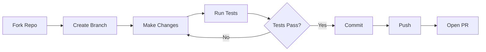
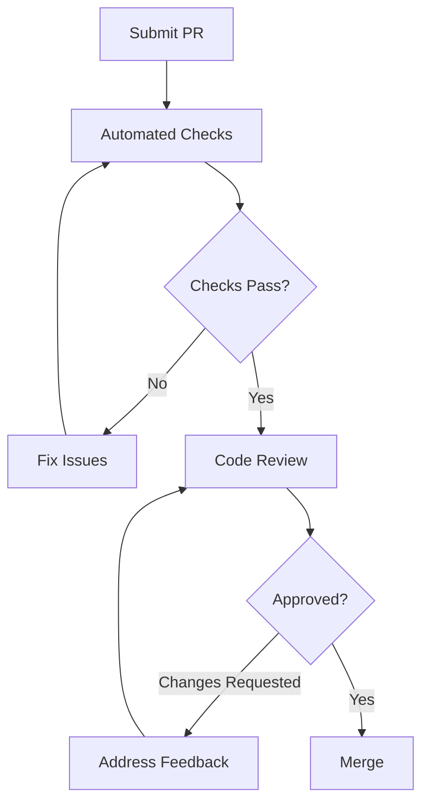

# Contributing

Thank you for your interest in contributing to nagents! This guide will help you get started.

## Getting Started

### Prerequisites

- Python `>=3.11, <4.0`
- [Poetry](https://python-poetry.org/) for the workflow below, or an existing virtual environment with pip
- Git for version control

### Development Setup

=== "Quick Setup"

    ```bash
    # Clone the repository
    git clone https://github.com/abi-jey/nagents.git
    cd nagents

    # Install dependencies
    poetry install -E dev -E tui -E voice

    # Install pre-commit hooks
    poetry run pre-commit install

    # Verify setup
    poetry run pytest
    ```

=== "Detailed Setup"

    ```bash
    # Clone the repository
    git clone https://github.com/abi-jey/nagents.git
    cd nagents

    # Create virtual environment and install all dependencies
    poetry install -E dev -E docs -E tui -E voice  # (1)!

    # Install pre-commit hooks
    poetry run pre-commit install

    # Run the full test suite
    poetry run pytest -v

    # Run type checking
    poetry run mypy src/nagents

    # Build documentation and check warnings
    poetry run mkdocs build --strict
    ```

    1. These are package extras from `[project.optional-dependencies]`, not Poetry dependency groups. `dev`, `tui`, and `voice` match the test installation in CI; `docs` adds MkDocs and mkdocstrings.

If you already use a local `.venv`, keep that environment rather than letting
multiple tools manage it. The equivalent editable install is
`.venv/bin/python -m pip install -e '.[dev,docs,tui,voice]'`; use `.venv/bin/pytest`,
`.venv/bin/mypy`, and `.venv/bin/mkdocs` in place of `poetry run` below.
The build backend is Hatchling, regardless of the environment manager.

!!! important "ngn is source-only"
    The current terminal harness is not yet a published CLI release. Install
    this checkout, not an older PyPI build, when testing `ngn`. A matching
    package version alone does not prove it contains the current CLI. See
    [ngn Installation](../guide/ngn-installation.md).

## Development Workflow



### Creating a Branch

```bash
# Create a feature branch
git checkout -b feature/your-feature-name

# Or a bugfix branch
git checkout -b fix/issue-description
```

!!! tip "Branch Naming"
    Use descriptive branch names:

    - `feature/add-streaming-support`
    - `fix/session-manager-memory-leak`
    - `docs/update-quickstart`
    - `refactor/simplify-provider-interface`

## Code Standards

### Code Style

We use [Ruff](https://github.com/astral-sh/ruff) for linting and formatting:

```bash
# Format code
poetry run ruff format .

# Lint code
poetry run ruff check .

# Fix auto-fixable issues
poetry run ruff check --fix .
```

### Type Hints

All code must include type hints. We use [mypy](https://mypy-lang.org/) for type checking:

```bash
poetry run mypy src/nagents
```

??? example "Type Hint Examples"

    ```python
    from nagents import Message


    def user_message(content: str) -> Message:
        return Message(role="user", content=content)
    ```

### Docstrings

Use Google-style docstrings:

```python
def percentage(percent: float, amount: float) -> float:
    """Calculate a percentage of an amount.

    Args:
        percent: Percentage to calculate, such as 15.
        amount: Original amount.

    Returns:
        The calculated portion of the amount.

    Example:
        >>> percentage(15, 100)
        15.0
    """
    return percent * amount / 100
```

## Testing

### Running Tests

```bash
# Run all tests
poetry run pytest

# Run with coverage
poetry run pytest --cov=nagents --cov-report=html

# Run specific test file
poetry run pytest tests/test_dynamic_tools.py

# Run tests matching a pattern
poetry run pytest -k "test_session"

# Run with verbose output
poetry run pytest -v
```

### Writing Tests

Tests use ordinary synchronous pytest functions and `asyncio.run()` for async
scenarios; `pytest-asyncio` is not a declared dependency. Use `tmp_path` for
databases and synthetic credentials with mocked providers/HTTP, not real API
keys. `tests/conftest.py` isolates user configuration and data directories.

```python title="tests/test_session_example.py"
import asyncio
from pathlib import Path

from nagents import Message, SessionManager


def test_session_history(tmp_path: Path) -> None:
    async def scenario() -> None:
        manager = SessionManager(tmp_path / "test.db")
        session_id = await manager.get_or_create_session("conversation-1", "user-1")
        await manager.add_message(session_id, Message(role="user", content="Hello"))

        history = await manager.get_history(session_id)
        assert len(history) == 1
        assert history[0].content == "Hello"
        assert await manager.session_exists(session_id)

    asyncio.run(scenario())
```

For an agent test with a fake provider, see `tests/test_dynamic_tools.py`. For
HTTP-contract fixtures, see `tests/test_gateway_provider.py`. Keep live-service
experiments explicit and separate from the default test suite.

### Test Markers

The custom marker currently registered in `tests/conftest.py` is
`@pytest.mark.requires_posix`. Those tests are automatically skipped on
non-POSIX hosts. Select them with `poetry run pytest -m requires_posix` or
exclude them with `poetry run pytest -m "not requires_posix"`.

There are no registered `unit`, `integration`, or `slow` marker groups. Select
tests by file or `-k` expression instead of assuming those categories exist.

## Pre-commit Hooks

After `pre-commit install`, hooks run automatically on `git commit`. The checked-in
`.pre-commit-config.yaml` is authoritative for hook versions and arguments. It
includes whitespace, YAML, large-file and merge-conflict checks, Ruff linting
and formatting, and mypy. In particular, the YAML hook allows MkDocs' Python
tags; do not replace its configuration with a generic YAML example.

Run hooks manually:

```bash
# Run on all files
poetry run pre-commit run --all-files

# Run specific hook
poetry run pre-commit run ruff --all-files
```

## Documentation

### Building Docs

```bash
# Serve docs locally with hot reload
poetry run mkdocs serve

# Build static docs
poetry run mkdocs build --strict
```

The API reference is generated from this checkout's `src/nagents` using
mkdocstrings. Keep navigation targets and local links valid, and distinguish
research/proposals from implemented behavior. Do not infer feature availability
from a package version or an unverified upstream model name.

### Documentation Style

Use Material for MkDocs features:

=== "Admonitions"

    ```markdown
    !!! note "Title"
        Note content here.

    !!! warning
        Warning without custom title.

    ??? tip "Collapsible"
        Hidden by default.
    ```

=== "Code Blocks"

    ````markdown
    ```python title="example.py" linenums="1" hl_lines="2 3"
    def hello():
        message = "Hello"  # Highlighted
        print(message)     # Highlighted
    ```
    ````

=== "Tabs"

    ```markdown
    === "Python"
        ```python
        print("Hello")
        ```

    === "JavaScript"
        ```javascript
        console.log("Hello");
        ```
    ```

## Pull Request Process

### Before Submitting

- [ ] Code follows project style guidelines
- [ ] All tests pass locally
- [ ] Pre-commit hooks pass
- [ ] Documentation is updated (if applicable)
- [ ] Commit messages are clear and descriptive

### PR Template

```markdown
## Description
Brief description of changes.

## Type of Change
- [ ] Bug fix
- [ ] New feature
- [ ] Breaking change
- [ ] Documentation update

## Testing
Describe how to test the changes.

## Checklist
- [ ] Tests added/updated
- [ ] Documentation updated
- [ ] CHANGELOG updated (if applicable)
```

### Review Process



## Issue Guidelines

### Reporting Bugs

!!! bug "Bug Report Template"

    **Description**: Clear description of the bug

    **Steps to Reproduce**:
    1. Step one
    2. Step two
    3. ...

    **Expected Behavior**: What should happen

    **Actual Behavior**: What actually happens

    **Environment**:
    - OS: [e.g., Ubuntu 22.04]
    - Python: [e.g., 3.11.4]
    - nagents version: [e.g., 0.1.0]

### Feature Requests

!!! tip "Feature Request Template"

    **Problem**: What problem does this solve?

    **Proposed Solution**: How should it work?

    **Alternatives**: Other approaches considered

    **Additional Context**: Any other information

## Release Process

Releases are automated via GitHub Actions when a tag is pushed:

```bash
# Create a new version tag
git tag v0.2.0
git push origin v0.2.0
```

Version numbering follows [Semantic Versioning](https://semver.org/):

- **MAJOR**: Breaking changes
- **MINOR**: New features (backwards compatible)
- **PATCH**: Bug fixes (backwards compatible)

## Getting Help

- **GitHub Issues**: For bugs and feature requests
- **GitHub Discussions**: For questions and general discussion
- **Pull Requests**: For code contributions

!!! info "Code of Conduct"
    Please be respectful and constructive in all interactions. We're all here to build something great together.

## License

By contributing, you agree that your contributions will be licensed under the project's MIT License.
