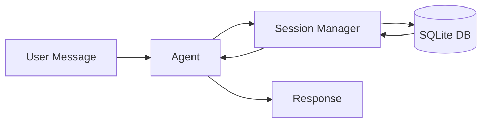
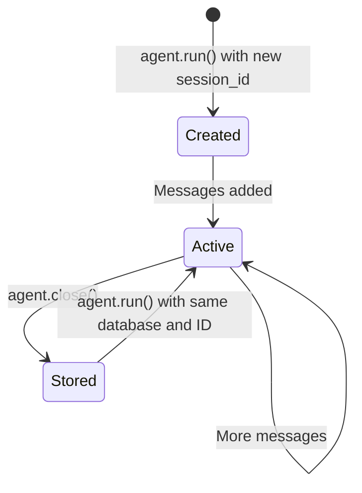

# Sessions

Sessions enable conversation persistence across multiple interactions, allowing your agent to maintain context and remember previous messages.

## Overview



---

## Session Manager

!!! important "Required Component"
    The `SessionManager` is **required** when creating an Agent. It handles all conversation persistence.

Create a session manager with a SQLite database:

```python title="session_setup.py"
from pathlib import Path
from nagents import Agent, SessionManager, Provider, ProviderType

# Create session manager
session_manager = SessionManager(Path("sessions.db"))  # (1)!

# Create agent with session manager
agent = Agent(
    provider=provider,
    session_manager=session_manager,
)
```

1. The database file will be created automatically if it doesn't exist.

---

## Using Sessions

Specify a `session_id` to maintain conversation history:

```python title="session_usage.py" hl_lines="4 11"
# First interaction
async for event in agent.run(
    "My name is Alice",
    session_id="user-123",
):
    ...

# Later interaction (same session)
async for event in agent.run(
    "What's my name?",
    session_id="user-123",
):
    # Agent remembers: "Your name is Alice"
    ...
```

!!! tip "Session ID Best Practices"
    Use meaningful, consistent session IDs:

    - User-based: `user-{user_id}`
    - Conversation-based: `conv-{uuid}`
    - Thread-based: `thread-{thread_id}`

---

## Auto-Generated Sessions

If no `session_id` is provided, a new session is created automatically:

```python title="auto_session.py"
from nagents import DoneEvent

async for event in agent.run("Hello"):
    if isinstance(event, DoneEvent):
        print(f"Session ID: {event.session_id}")
        # Save this ID to continue the conversation later
```

---

## Session Data

Sessions store:

- [x] **Conversation messages** - User, assistant, tool calls/results
- [x] **Session metadata** - created_at, updated_at, user_id
- [x] **Compaction boundary** - Selects the active history after compaction

The agent's `system_prompt` is applied when assembling requests, not stored as
a session creation field. Supply it again when constructing an agent after a
restart.

The SQLite tables are `v2_sessions` and `v2_messages`, managed by migrations in
`src/nagents/migrations/sessions.py`. Prefer the [Session API](../api/session.md)
over copying SQL schemas into application code. `get_history()` respects the
compaction boundary; it is not a raw transcript export.

---

## User Association

Associate sessions with users for multi-user applications:

```python title="user_sessions.py" hl_lines="4"
async for event in agent.run(
    "Hello",
    session_id="conversation-456",
    user_id="user-123",
):
    ...
```

This allows you to:

- Query all sessions for a user
- Implement user-specific context
- Track usage per user

---

## Session Lifecycle



```python title="lifecycle.py"
from pathlib import Path
from nagents import Agent, SessionManager


async def main():
    session_manager = SessionManager(Path("sessions.db"))

    # Initialize (creates tables if needed)
    await session_manager.initialize()  # (1)!

    agent = Agent(provider=provider, session_manager=session_manager)

    # Sessions are automatically created/updated during agent.run()
    async for event in agent.run("Hello", session_id="test"):
        ...

    # Close when done
    await agent.close()  # (2)!
```

1. Called automatically by Agent, but can be called explicitly.
2. Releases the agent's provider resources. Stored sessions remain available;
   `SessionManager` opens short-lived SQLite connections per operation and has
   no public `close()` method.

---

## Multiple Sessions

Use separate IDs for separate conversations. The following turns are
sequential; serialize runs for the same session and avoid sharing one live
agent/provider across concurrent runs:

```python title="multi_session.py"
# User A's conversation
async for event in agent.run(
    "I like pizza",
    session_id="user-a-session",
):
    ...

# User B's conversation (completely separate)
async for event in agent.run(
    "I prefer sushi",
    session_id="user-b-session",
):
    ...

# Back to User A (remembers pizza preference)
async for event in agent.run(
    "What food do I like?",
    session_id="user-a-session",
):
    # Agent responds about pizza
    ...
```

---

## Session Isolation

Each session ID selects a separate conversation history. This is not an
authorization boundary: applications must enforce access to session IDs, and
`user_id` is stored metadata rather than an access check.

```python title="isolation_example.py"
# Session 1: Set a name
async for event in agent.run("My name is Alice", session_id="session-1"):
    pass

# Session 2: Different conversation
async for event in agent.run("My name is Bob", session_id="session-2"):
    pass

# Session 1: Remembers Alice
async for event in agent.run("What's my name?", session_id="session-1"):
    pass
# Response: "Your name is Alice"

# Session 2: Remembers Bob
async for event in agent.run("What's my name?", session_id="session-2"):
    pass
# Response: "Your name is Bob"
```

---

## Example: Chat Application

Here's a complete example of a session-based chat application:

```python title="chat_app.py" linenums="1"
import asyncio
import os
from pathlib import Path
from nagents import Agent, ErrorEvent, Provider, ProviderType, SessionManager, TextChunkEvent


async def chat(session_id: str):
    """Run an interactive chat session."""

    provider = Provider(
        provider_type=ProviderType.OPENAI_COMPATIBLE,
        api_key=os.environ["OPENAI_API_KEY"],
        model=os.environ["OPENAI_MODEL"],
    )

    session_manager = SessionManager(Path("chat.db"))

    agent = Agent(
        provider=provider,
        session_manager=session_manager,
        system_prompt="You are a helpful assistant. Be concise.",
        streaming=True,
    )

    print(f"Chat session: {session_id}")
    print("Type 'quit' to exit\n")

    try:
        while True:
            user_input = (await asyncio.to_thread(input, "You: ")).strip()
            if user_input.lower() == "quit":
                break
            if not user_input:
                continue

            print("Assistant: ", end="")
            async for event in agent.run(user_input, session_id=session_id):
                if isinstance(event, TextChunkEvent):
                    print(event.chunk, end="", flush=True)
                elif isinstance(event, ErrorEvent):
                    print(f"\nError: {event.message}")
            print()  # newline
    finally:
        await agent.close()
    print("\nGoodbye!")


if __name__ == "__main__":
    import sys

    session_id = sys.argv[1] if len(sys.argv) > 1 else "default"
    asyncio.run(chat(session_id))
```

Set `OPENAI_API_KEY` and `OPENAI_MODEL` to credentials and a model available to
your account, then run in your project's virtual environment:

```bash
# Start a new session
python chat_app.py my-session

# Continue the same session later
python chat_app.py my-session
```

---

## Best Practices

!!! success "Session Management Tips"

    1. **Use meaningful session IDs** - Makes debugging easier
    2. **Associate with users** - Use `user_id` for multi-user apps
    3. **Handle session cleanup** - Consider implementing session expiration
    4. **Don't store sensitive data** - Sessions are stored in SQLite
    5. **Close properly** - Always call `agent.close()` when done
